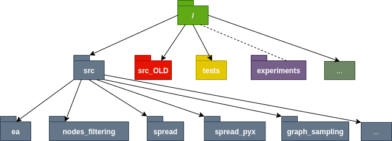

# Influence-Maximization
Code and data for experiments with evolutionary influence maximization

This repository contains source code and some experimental scripts for experimental setups. 
The inputs, outputs, plots and other experiment-specific files are contained in another subrepository: 
[experiments](https://github.com/katerynak/Influence-Maximization-experiments).

Influence-Maximization repository is organized as follows: 

* src: source code containing code of the implemented features
* src_OLD: old source code in case it comes at hand
* tests: some tests needed to check whether some implemented functions behave properly
* experiments: subrepository containing inputs and outputs of each experimental setup
* datasets: contains script that downloads datasets

The src module contains the following submodules:

* ea: code related to each of the components of the evolutionary algorithm
* spread: implementations of fitness functions approximations
* spread_pyx: cython code and compilation script
* nodes_filtering: implementation of different nodes filtering strategies
* additional_experimental_scripts: experimental setup scripts of all old experiments

and files:
* evolutionary_algorithm_exec: script containing the execution pipeline: graph loading, 
nodes filtering, smart initialization, execution of the ea algorithm with appropriate parameters,
 output logging..
 * heuristics: implementation of other heuristics we compare with
 * multi_armed_bandit: implementation of the UCB1 algorithm for multi-armed-bandit problem (used for 
 dynamic mutation selection)
 * smart_initialization: implementation of different smart initialization techniques
 * utils: mix of helpful functions
 * experiments: script used for execution of multiple experiments
 * load.py: graph loading code
 * mo_evolutionaryalgorithm: multi-objective old evolutionary algorithm code
 

To run the whole pipeline:

``
cd Influence-Maximization;
python -m src.evolutionary_algorithm_exec --config_file src/example_experimental_setup.json
``

You need to specify all the hyperparameters of the algorithm in a .json config
file and pass it as a parameter of the script. The results are stored in a
directory specified as a script argument (`--out_dir`).

## Influence parameters

* k: Seed set size, default 10.
* p: Probability of influence spread in the IC model, default 0.01.
* spread_function: Fitness function approximation, default "monte_carlo_max_hop", and choices "monte_carlo", "monte_carlo_max_hop", "two_hop".
* no_simulations: Number of simulations for spread calculation when the Monte Carlo fitness function is used, default 100.
* max_hop: Number of max hops for the Monte Carlo max hop function, default 3.
* model: Influence propagation model, default 'WC', and choices 'IC', 'WC'.

## Evolutionary parameters

* population_size: EA population size, default 100.
* offspring_size: EA offspring size, default 4.
* max_generations: Generational budget, default 100.
* crossover_rate: EA crossover rate, default 1.0.
* mutation_rate: EA mutation rate, default 0.1.
* tournament_size: EA tournament size, default 5.
* num_elites: EA number of elite individuals, default 1.
* dynamic_population: If true, dynamic population size is used, default True.
* max_generations_percentage_without_improvement: Percentage of the generational budget to use for smart stop condition, EA stops when for this percentage of generations there is no improvement, default 0.5.
* n_parallel: Number of processes to be used for concurrent computation of the EA algorithm, default 4.
* random_seed: Seed to initialize the pseudo-random number generation, default 0.

## EA initialization and improvements parameters

* smart_initialization: If set, an individual containing the best nodes according to the selected centrality metric will be inserted into the initial population. Default "degree_random", choices "none", "degree", "eigenvector", "katz", "closeness", "betweenness", "community", "community_degree", "community_degree_spectral", "degree_random", "degree_random_ranked".
* smart_initialization_percentage: Percentage of "smart" initial population, to be specified when multiple individuals technique is used. Default None.
* community_detection_algorithm: Algorithm to be used for community detection, default None, choices "louvain", "spectral_clustering".
* n_clusters: Useful only for smart initialization with spectral clustering, the scale number of clusters to be used, the actual number of clusters will become equal to k*n_clusters. Default None.
* min_degree: Minimum degree for a node to be inserted into nodes pool in EA. Default None.
* filter_best_spread_nodes: If true, best spread filter is used. Default True.
* search_space_size_min, search_space_size_max: Lower/upper bound on the number of combinations. Default None.

## Smart mutations parameters

* node2vec_file: EA node2vec_file, in case the node embeddings are used. Default None.
* moving_avg_len: Moving average length for multi-armed bandit problem. Default None.

## Graph setup parameters

* g_nodes: Number of nodes in case the graph is generated. Default None.
* g_new_edges: Number of new edges in the barabasi-albert graphs. Default None.
* g_type: Graph type. Default 'wiki', choices 'barabasi_albert', 'gaussian_random_partition', 'wiki', 'amazon', 'epinions', 'twitter', 'facebook', 'CA-GrQc', "tiny_wiki", "tiny_amazon", "tiny_CA-GrQc", "tiny_wiki_community", "tiny_amazon_community", "tiny_CA-GrQc_community".
* g_seed: Random seed of the graph, in case if generated. Default None.
* g_file: Location of the graph file. Default None.

## Input/output setup

* out_dir: Location of the output directory in case if outfile is preferred to have a default name. Default None.
* config_file: Input json file containing the experimental setup: arguments for the script. Default None.

## Limitations

Pay attention: when you change the `mutation_operator` parameter, currently you
need to add a decorator `@inspyred.ec.variators.mutator` to the selected mutation
function in `src/ea/mutators.py`.

Python and libraries versions currently used:

* python 3.6.8
* inspyred                  1.0.1 
* networkx                  2.3 
* numpy                     1.16.3 
* cython                    0.29.13 
* node2vec                  0.3.1 
* gensim                    3.8.1 
* pandas                    0.24.2 
